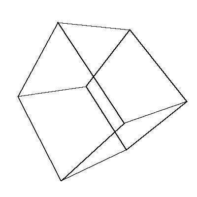

# 3D-Cube
 
Rendering cube in python in pygame and only for generating images.

## 3DCubePyGame.py
This program is for showing 3D cube in pygame window. The setup is very simple. Just clone the repository, install pygame and math library 
and run the file.

## 3DCubeWithRender.py
This progam is for generating image of 3D cube rotated by you given axis. The setup is very simple, just clone the repository, install pygame and math libraries and run the program. You will get one 16:9 image in jpg with cube on black background.